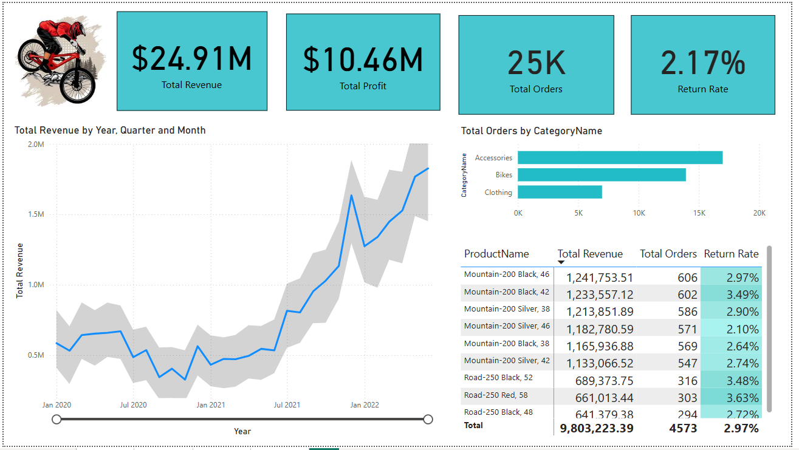

# Adventure_Data_Analysis

# Overview

The Adventure Data Project is a Power BI dashboard that provides insightful visualizations and analysis of sales performance, total revenue, and order statistics. It is designed to help businesses track their financial and operational performance.

 &nbsp;

# Features

Total Revenue Analysis: Displays revenue trends over time.

Profitability Metrics: Shows total profit across different periods.

Order and Return Rate Statistics: Monitors total orders and return percentages.

Product Performance: Highlights top-performing products by revenue and order count.

Category and Country-based Order Analysis: Compares order distribution across product categories and geographic regions.

# Key Metrics

Total Revenue: $24.91M

Total Profit: $10.46M

Total Orders: 25K

# Technologies Used

Power BI: Data visualization and reporting.

Microsoft Excel: Data storage and processing.

DAX (Data Analysis Expressions): Used for advanced calculations within Power BI.

# Future Enhancements

Integration with live data sources for real-time analysis.

Advanced predictive analytics using machine learning.

Customizable dashboard layouts based on user preferences.

Automated email reporting for key stakeholders.

